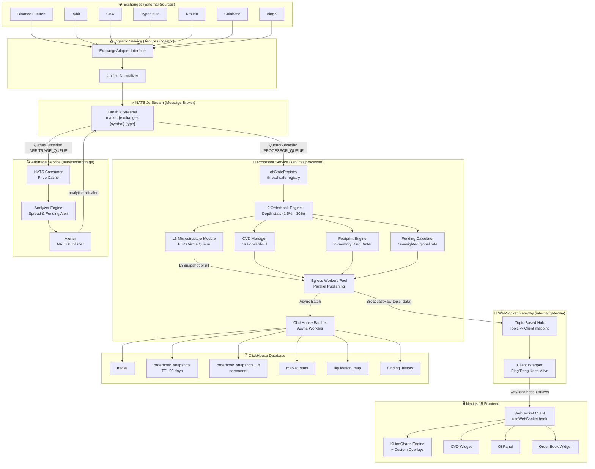

# QUANTIX — Professional Crypto Order Flow Platform

**QUANTIX** is a high-performance cryptocurrency analytics dashboard for professional and positional traders. It provides real-time **Order Flow** analysis, charting, and market microstructure data aggregated from multiple exchanges simultaneously.

<!-- markdownlint-disable MD033 -->

<!-- markdownlint-enable MD033 -->

---

## 🚀 Key Features

### 📊 Professional Order Flow Charting

- **KLineCharts Engine**: Ultra-low-latency canvas-based charting engine optimized for high-tick data and custom overlays.
- **Liquidation Bubbles**: Real-time forced liquidations mapped visually on the price axis with volume-proportional bubble sizes.
- **Open Interest (OI) Panels**: Synchronized OI panels with delta-bar change visualization.
- **Cumulative Volume Delta (CVD)**: Real-time accumulation of buy/sell order flow to detect hidden market absorption.
- **CVD Forward-Filling**: 1-second ticker ensures a continuous, gap-free CVD stream even during low-activity periods.
- **Multi-Chart Sync**: 2x1 and 2x2 layouts with cursor, zoom, and timeframe synchronization across all panels.

### 🔬 Market Microstructure (L3) — Feature Flagged

- **L3 Estimation Engine**: Reconstructs individual resting limit orders from aggregated L2 data using FIFO virtual queues.
- **K-Means Clustering**: Groups estimated orders into **Retail / Pro / Whale** categories for visual representation.
- **Zero-Cost Pass-Through**: Disabled by default (`ENABLE_L3=false`). When off, `l3Mgr` is never allocated — **zero CPU or RAM**. Activate via env var.

### ✍️ Advanced Drawing Suite

- **High-Performance Draft Mode**: Zero-lag rendering via dual-canvas overlay.
- **Precision Tools**: **Brush** (Quadratic Curves) and **Rectangle** with per-stroke color, thickness, and opacity.
- **Adaptive Toolbar**: Auto-scrolling drawing bar for compressed workspace layouts.

### 🖥️ Multi-Monitor Workspace

- **Zero-Lag Dual-Screen Sync**: Secondary workspace at `/platform/workspace` via the **BroadcastChannel API**.
- **Dynamic Widget Routing**: Move individual widgets between main and secondary workspace.
- **Persistent Layout**: Widget positions, visibility, and sizes persisted per workspace across sessions.

### ⚙️ Backend & Data Core

- **Multi-Exchange Ingestor**: Adapters for **Binance Futures, Bybit, OKX, Hyperliquid, Kraken, Coinbase, BingX** — all streaming into a single unified pipeline.
- **Go Microservices**: High-throughput ingestion, processing, and arbitrage scanning written in Go 1.22+.
- **Historical Persistence**: ClickHouse with ZSTD(3) codecs, 90-day TTL on raw snapshots, and permanent hourly aggregate tables.
- **Cross-Exchange Arbitrage Service**: Dedicated `arbitrage` microservice detecting basis spreads and funding rate anomalies.

---

## 🛠️ Tech Stack

### Frontend

| Layer | Technology |
| --- | --- |
| Framework | [Next.js 15](https://nextjs.org/) (App Router, React 19) |
| Styling | [Tailwind CSS](https://tailwindcss.com/) + [Shadcn UI](https://ui.shadcn.com/) |
| Charts | [KLineCharts](https://klinecharts.com/) (Canvas-based) |
| State | [Zustand](https://github.com/pmndrs/zustand) |
| Cross-Window Sync | [BroadcastChannel API](https://developer.mozilla.org/en-US/docs/Web/API/BroadcastChannel) |
| Drag & Drop | [dnd kit](https://dndkit.com/) |

### Backend (Go Microservices)

| Layer | Technology |
| --- | --- |
| Language | [Go 1.22+](https://go.dev/) |
| Message Broker | [NATS JetStream](https://nats.io/) |
| Market Data DB | [ClickHouse](https://clickhouse.com/) (MergeTree / SummingMergeTree / ReplacingMergeTree) |
| WebSocket | [Gorilla WebSocket](https://github.com/gorilla/websocket) |
| JSON Engine | [goccy/go-json](https://github.com/goccy/go-json) (high-perf serialization) |
| User/Auth DB | [PostgreSQL](https://www.postgresql.org/) + [Prisma](https://www.prisma.io/) |

---

## ⚙️ Backend Microarchitecture

> Below is the complete data flow from exchange WebSockets all the way to your browser.



---

## 🔬 Module-by-Module Breakdown

### `services/ingestor` — The Data Collector

Stays permanently connected to exchange WebSockets and converts raw, inconsistent JSON formats into clean Go structs for the entire platform.

- **`ExchangeAdapter` Interface** (`internal/exchanges/interface.go`): Formal contract that every exchange must implement. Each adapter is split into `adapter.go`, `orderbook.go`, `trades.go`, `util.go`.
- **NATS Publishing**: After normalization, every event is published to `market.{exchange}.{symbol}.{type}`.

**Why NATS?** If the Processor crashes, NATS buffers the messages. When it restarts, it picks up exactly where it left off — no data loss.

---

### `services/processor` — The Brain

Core calculation engine. Subscribes to the NATS queue, rebuilds the full L2 orderbook in memory, and derives all metrics from it.

- **`internal/orderbook/`** — Consolidated L2 engine (`book.go`, `updater.go`). Thread-safe maps + cached bestBid/bestAsk. Calculates liquidity depth at 1.5%, 3%, 5%, 8%, 10%, 15%, and 30% intervals as a single source of truth for all services.
- **`internal/cvd/engine.go`** — CVD across `raw`, `1m`, `5m`, `15m`, `1h`. Ring buffer, 24h pruning, 1s forward-fill ticker for gap-free charts.
- **`internal/footprint/engine.go`** — In-memory Footprint ring buffer. Emits `FootprintDelta` per trade for live candle updates.
- **`internal/dom/` & `internal/heatmap/`** — Migrated engines for Depth of Market and Orderbook Heatmaps, preserved for future visualization wiring.
- **`internal/funding/calculator.go`** — OI-weighted global funding rate. `UpdateExchange()` merges both fields atomically under one lock.
- **`internal/l3/`** *(Feature Flagged)* — When `ENABLE_L3=true`: FIFO virtual-order queue + K-Means clustering (Retail/Pro/Whale). When **off**: `l3Mgr` is `nil` — zero allocation, zero CPU.
- **`internal/history/`** — Async ClickHouse batcher. `strconv.ParseFloat` with explicit error logging (no silent zero-inserts).

**Egress Workers**: Finished payloads go into a buffered channel (capacity 10,000). 4 goroutines drain in parallel. Channel is closed cleanly on shutdown so all goroutines exit via `range`.

---

### `internal/gateway` — The Reception Desk

Topic-based WebSocket Hub. Browsers connect directly to this.

- **`hub.go`**: `map[topic]map[*Client]bool`. `BroadcastRaw` skips JSON marshalling when bytes are already ready. Double-checked locking on read → write lock upgrade.
- **`client.go`**: `send chan []byte` of 256 slots. Ping/Pong every 54s. Stalled clients are skipped (non-blocking send) and cleaned up on reconnect.

```json
// Browser subscribes:
{"action": "subscribe", "topic": "orderbook.binancef.btcusdt"}

// Browser receives in real-time:
{"type": "orderbook", "exchange": "binancef", "symbol": "btcusdt", "bids": [...], "asks": [...]}
```

---

### `services/arbitrage` — The Arbitrage Hunter

Standalone microservice watching the same NATS streams for cross-exchange anomalies. Disabled by default (`ENABLE_SCANNER=false`).

- **`consumer.go`**: Thread-safe in-memory price + funding rate cache.
- **`analyzer.go`**: Sweeps cache periodically — **Basis** (spot vs perp), **Cross-Exchange Spread**, **Funding Rate anomalies**.
- **`alerter.go`**: Publishes `ArbitrageAlert` structs to NATS → frontend.

---

### `pkg/shared` — Shared Utilities

| Package | Contents |
| --- | --- |
| `config` | `GetEnv()`, `GetEnvBool()` with defaults |
| `messaging` | `InitJetStream()`, `PublishJSON()`, topic generators |
| `models` | All canonical Go structs (`MarketEvent`, `Trade`, `OrderbookSnapshot`…) |
| `db` | Consolidated PostgreSQL & ClickHouse shared drivers |
| `intervals` | Shared `Ms` and `RangeMs` maps — single source of truth for all time intervals |

---

### ClickHouse Schema

> Full DDL: `database/clickhouse_schema.sql`

| Table | Engine | Key Details |
| --- | --- | --- |
| `trades` | MergeTree | Raw aggressive trades |
| `orderbook_snapshots` | MergeTree | L2 snapshots · **TTL 90 days** · ZSTD(3) on all Float/Array cols |
| `orderbook_snapshots_1h` | ReplacingMergeTree | Hourly aggregated snapshots · **permanent** |
| `market_stats` | MergeTree | Depths: 1.5 / 3 / 5 / 8 / 10 / **15** / 30% · ZSTD(3) |
| `liquidation_map` | SummingMergeTree | Predicted levels at 5x/10x/25x/50x/100x leverage |
| `funding_history` | MergeTree | OI-weighted aggregated global funding rate |

---

## ⚙️ Feature Flags

All heavy modules are individually togglable via environment variables:

| Variable | Default | Description |
| --- | --- | --- |
| `NATS_URL` | `nats://localhost:4222` | NATS JetStream connection |
| `CLICKHOUSE_ADDR` | `localhost:9000` | ClickHouse TCP address |
| `ENABLE_FOOTPRINT` | `true` | In-memory Footprint Engine |
| `ENABLE_HEATMAP` | `true` | DOM Snapshot capture for Heatmap |
| `ENABLE_LIQUIDATION` | `true` | Liquidation bubble stream |
| `ENABLE_DOM` | `false` | DOM Profile aggregation (high CPU) |
| `ENABLE_L3` | `false` | L3 Order Reconstructor (very high CPU/RAM) |
| `ENABLE_MARK_PRICE_STATS` | `false` | Mark Price → market_stats |
| `ENABLE_LONG_SHORT_RATIO` | `false` | Long/Short Ratio → market_stats |
| `ENABLE_SCANNER` | `false` | Cross-exchange arbitrage microservice |

---

## 📂 Project Structure

```text
QUANTIX/
├── database/                # Database schemas (PostgreSQL & ClickHouse)
├── pkg/
│   └── shared/              # Common logic & utilities
│       ├── analytics/       # Indicators & math
│       ├── config/          # Env & yaml loading
│       ├── db/              # Database drivers/wrappers
│       ├── messaging/       # NATS implementation
│       └── models/          # Shared data structs (MarketEvent, Trade...)
├── services/
│   ├── api/                 # WebSocket & HTTP Gateway
│   ├── arbitrage/           # Cross-exchange analysis
│   ├── ingestor/            # Data acquisition (Adapters: Binance, OKX...)
│   └── processor/           # Analytics engine (CVD, Heatmap, Footprint...)
├── src/                     # Next.js 15 frontend
├── cmd/                     # Misc CLI tools
├── docs/                    # Architectural & API documentation
├── tests/                   # Integration and verification tests
└── docker-compose.yml       # Infrastructure (NATS, ClickHouse)
```

---

## 🗺️ Roadmap & Current Progress

### ✅ Phase 1: Data Infrastructure [COMPLETE]

- [x] Multi-Exchange Ingestor — Binance, Bybit, OKX, Hyperliquid, Kraken, Coinbase, BingX
- [x] Unified `ExchangeAdapter` interface + modular `adapter/orderbook/trades/util` per exchange
- [x] NATS JetStream message broker with durable queues
- [x] ClickHouse persistence (MergeTree + SummingMergeTree + ReplacingMergeTree)
- [x] L2 Orderbook Engine — O(1) GetMidPrice via cached bestBid/bestAsk

### ✅ Phase 2: Order-Flow Engine [COMPLETE]

- [x] Real-time Liquidation Bubbles overlay
- [x] Synchronized Open Interest panel with delta bars
- [x] CVD with ring-buffer bucketing and 1s forward-fill ticker
- [x] Advanced Drawing Tools (Brush, Rectangle) with dual-canvas draft mode

### ✅ Phase 3.1: Multi-Chart & UX [COMPLETE]

- [x] Multi-Chart layout (2x1, 2x2) with full cursor, zoom, and crosshair sync
- [x] Draggable & Resizable widgets (DnD Kit)
- [x] Layout Persistence (LocalStorage + DB sync)
- [x] JS Script Indicator Editor — Sandboxed TA scripting environment

### ✅ Phase 3.2: Backend Analytics Services [COMPLETE]

- [x] WebSocket Pub/Sub Gateway — Topic-based Hub/Client architecture
- [x] L3 Microstructure Module — VirtualQueue FIFO + K-Means clustering (Feature Flagged)
- [x] ClickHouse Historical Batcher with ZSTD(3) codecs + 90-day TTL + permanent 1h aggregates
- [x] Footprint Engine — in-memory ring buffer + delta emission
- [x] Funding Rate Calculator — OI-weighted global rate with atomic UpdateExchange()
- [x] Cross-Exchange Arbitrage Scanner (renamed from `scanner` → `arbitrage`)
- [x] Modular Exchange Adapters — all 7 exchanges refactored to unified structure
- [x] **Architectural Audit & Cleanup**: Consolidated L2 stats calculation, removed redundant `internal/stats`, migrated legacy `dom`/`heatmap` code out of `state` package.
- [x] Shared `pkg/shared/intervals`, `strconv.ParseFloat` error handling, clean shutdown
- [x] **Structural Refactor**: Standardized service entry points (`cmd/main.go`), consolidated `pkg/shared/db` (added PostgreSQL), and centralized processor orchestrator.

### ⏳ Phase 3.3: Analytics UI [IN PROGRESS]

- [ ] DOM Heatmap Overlay — historical orderbook depth as chart background heatmap
- [ ] Footprint Charts — Bid/Ask volume clusters inside each candle
- [ ] Arbitrage Screener UI — sortable/filterable cross-exchange signal table

### 📅 Phase 4: Alerts & Automation [PLANNED]

- [ ] Alerting System: Price, OI, CVD, Liquidation triggers with Push/Email delivery
- [ ] Watchlist & Notes: Saved symbol lists with timestamps
- [ ] Portfolio Tracking: Read-only exchange API key integration

### 💰 Phase 5: Monetization [PLANNED]

- [ ] **Free tier**: Basic chart, 1 exchange
- [ ] **Pro tier (~$29/mo)**: All panels, 5 exchanges, alerts
- [ ] **Elite tier (~$79/mo)**: Footprint, DOM Heatmap, Liquidation Map, API access
- [ ] **Stripe** integration

---

## 🏁 Quick Start

### Prerequisites

- [Docker Desktop](https://www.docker.com/products/docker-desktop/) (for NATS + ClickHouse)
- [Go 1.22+](https://go.dev/dl/)
- [Node.js 20+](https://nodejs.org/)

### 1. Start the full dev stack (Windows)

```batch
start-dev.bat
```

Automatically:

1. Starts NATS JetStream + ClickHouse via Docker Compose
2. Launches `ingestor` → `processor` → `arbitrage` Go services
3. Waits for the WebSocket Gateway on port `8086`
4. Starts the Next.js frontend at `http://localhost:3000`

### 2. Manual start (Linux/macOS)

```bash
# Infrastructure
docker-compose up -d

# Ingestor
go run ./services/ingestor/cmd/

# Processor (ENABLE_L3=true activates L3 microstructure)
go run ./services/processor/cmd/

# Arbitrage screener (opt-in)
ENABLE_SCANNER=true go run ./services/arbitrage/cmd/

# Frontend
npm install && npm run dev
```

### 3. Connect a WebSocket test client

```json
// Connect to ws://localhost:8086/ws, then send:
{"action": "subscribe", "topic": "orderbook.binancef.btcusdt"}
{"action": "subscribe", "topic": "cvd.binancef.btcusdt"}
{"action": "subscribe", "topic": "analytics.arb.alert"}
```

---

## 🔒 Authentication

QUANTIX uses **Auth.js (NextAuth)** with:

- Google OAuth provider
- Email/Password credentials
- Session persistence via **PostgreSQL + Prisma**

Configure `.env.local` — see `.env.example` for required keys.

---

## 📜 License

Private repository. All rights reserved.
